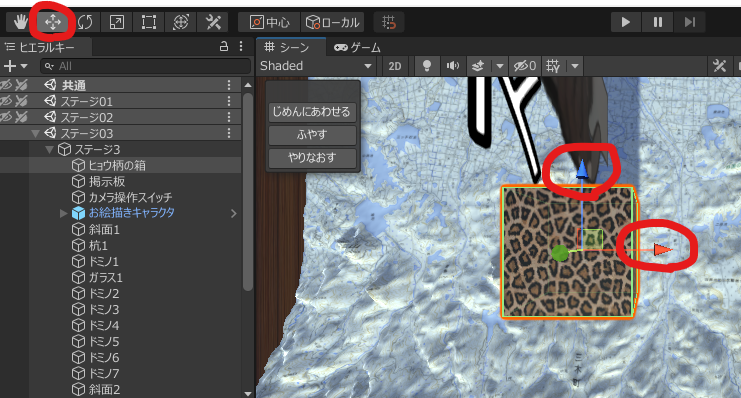

# sig4ng-ws

IGDA日本　SIG-for NextGeneration　による子供向けワークショップの教材です。ワークショップでは、1つのステージを、1人の参加者が担当して、みんなで1つの「からくり装置」を作ります。

----

## 同梱リソース

プロジェクト内で下記のリソースを同梱・利用しています。

* [Unityのパーティクルシステムで爆発を作る_からあげ編](https://styly.cc/ja/tips/explosion01)  
使用しているコードが[こちら](https://github.com/styly-dev/STYLY-Unity-Examples/tree/master/Assets/STYLY_Examples/Explosion_Sample)です。

* [富士山周辺の地形データ](https://terrain.party/)  
詳細はAssets/共通/mtfuji terrain/mtfuji README.txtを確認してください。切り出したエリアの緯度経度の情報が含まれます。

* [富士山周辺の地図データ](https://www.openstreetmap.org/copyright)
© OpenStreetMap contributors  
「エクスポート」に緯度経度を入力すると、地図上に矩形が表示されます。「共有」-「画像」で「独自の寸法を設定」を選び、エクスポート用に表示されている矩形に画像領域の矩形を重ねます。縮尺を修正してPNGでダウンロードする。得られた地図画像は、Assets/共通/MapMaterial.matに適用すると、地形に貼られます。

----

## ワークショップの準備

* Unity2020.3LTS  
これ以外のバージョンでの動作は確認していません。

* Unity Collaborate  
参加者がプロジェクトをリアルタイムで共有するために使います。

----

## ワークショップの進行

1時間目：  
はじめのアンケート  
今日できることのお話  
はじめの一歩  
地図に情報を書き込む  
自分の描いたキャラクタを登場させる  
休憩

2時間目：  
みんなの仕事を合体させる  
好きなだけ改造する  
休憩

3時間目：  
出来上がったものを見てみよう  
今日やったことのお話  
ふりかえり  
さいごのアンケート

----

### ワークショップで体験できること

* Unityを使って、みんなで1つのからくり装置を改造する
* 自分の描いたキャラクタをからくり装置に登場させる
* プロと同じ道具を使ってゲーム作りの一部を体験する

ゲームを作っている様子。1人では作っていない。

----

### はじめの一歩

1. [このプロジェクト](https://github.com/mnagaku/sig4ng-ws/archive/master.zip)をダウンロードして展開し、Unity2020.3を起動して、プロジェクトを開く。

2. 画面右のエリアのタブ「WS専用パネル」から自分の担当するステージを選ぶ。
（1度、自分の担当ではないステージのボタンを押してから、自分の担当ステージのボタンを押すことを推奨）

3. 画面上部の再生ボタン（▶、横向きの三角）で実行すると、動作が確認できる。もう1度再生ボタンを押すと、止まる。先に選んだ自分の担当するステージから、再生が始まるようになっている。

### 自分のステージを改造する

1. シーンの表示を俯瞰（見下ろし）にする。ヒエラルキーの「（箱のアイコン）ステージ？」（左に三角が付いたもの）をダブルクリックすると、画面中央にステージが表示される。シーンの右上にあるシーンギズモを操作して俯瞰視点に変更する。マウスホイールを操作して、拡大縮小を行える。

2. シーンにあるヒョウ柄の直方体（オブジェクト）をクリックして選択する。選択されると、オレンジの枠で表示される。他のオブジェクトも併せて選択されてしまったら、もう1回、直方体をクリックすると、直方体のみが選択される。

3. オブジェクトが選択された状態で、画面左上のトランスフォームツールズの上下の矢印のアイコンを選ぶと、オブジェクトに矢印が生える。この矢印をドラッグして動かすと、矢印に平行な方向にオブジェクトを移動させることができる。

4. トランスフォームツールズの回転のアイコンを選ぶとオブジェクトを回転させることができる。斜めの矢印のアイコンを選ぶとオブジェクトの大きさを変えられる
画面右側で、選択されたオブジェクトの情報を表示している「インスペクター」の「トランスフォーム」の数字を直接変更しても、位置、角度、大きさを変えることができる。

5. オブジェクトを選択した状態で「ふやす」ボタンを押すと、オブジェクトがコピーされる。オブジェクトを選択した状態で「じめんにつける」ボタンを押すと、オブジェクトが床にぴったりと乗った状態に調整される。操作の取り消しは、「やりなおす」ボタンを押す。選択したオブジェクトを消したい場合は、「DEL」キーで消せる。（消すよりも、いったん、ステージの外に移動させるのを推奨）

6. 少し変更したら、再生ボタンで動作を確認する。こまめに動作を確認することで、変更した結果が、ステージの動きのじゃまになっていないことを確認しながら作業を進められる。

### 地図に情報を書き込む

1. 自分の担当エリア内もしくは、中心のエリアで、ランドマークを探す。
2. ヒエラルキーで「掲示板」を選択して「ふやす」。
3. ふやした「掲示板」の「インスペクター」-「TextMeshPro - Text」-「Text Input」に、ランドマークの名前と、説明を書く。
4. ランドマークの場所まで移動させる。

ランドマークの例：
- 今日、ここまで来るのに通った駅や場所は、地図の上にないかな？
- 動物園や公園など、行ったことのある場所は、地図の上にないかな？
- おいしいラーメン屋さんの場所

### 自分の描いたキャラクタを登場させる

[お絵描きWS](https://drawws.kgr-lab.com/?lang=ja)

1. シートにお絵描きをして、webカメラで撮り込む。撮り込んだキャラクタの番号を覚えておく。

2. ヒエラルキーで「お絵描きキャラクタ」を選択する

3. 「インスペクター」-「Drawws(スクリプト)」のCharNoに自分の描いたキャラクタの番号を入れる。

4. 実行して確認する。

5. 「お絵描きキャラクタ」のコピーを作って、配置を決めて、キャラクタの番号を設定すると、2つ目も出せる。

### みんなの仕事を合体させる

1. CTRL+S、もしくは、「ファイル」-「シーンを保存」で、自分の作業を保存する。

2. 他の人の作業内容が配られていて、自分がまだ取り込んでいない時、画面上部のコラボマークにオレンジの下矢印がつく。「Sync」を押すと取り込まれて、オレンジの下矢印は消える。取り込んだ内容を画面上に反映させるために「再ロード」を求められるので、ボタンを押す。

3. 自分の作業内容を他の人に配れる状態になると、画面上部のコラボマークに青の上矢印がつく。自分のステージに関係するものだけチェックをつけて、変更内容を書いて（書かなくてもいい）、「Publish」を押すと送信されて、青の上矢印は消える。他の人が「Publish」中だと失敗することがあるので、ひと呼吸待ってから、やり直す。

4. 画面上部のコラボマークに矢印がついていない状態が、全員の最新の作業内容を取り込んだ状態。この状態で実行すると、みんなの仕事が合体した動作を見ることができる。

### 好きなだけ改造する

#### ドミノの並びを変えてみる

「ヒョウ柄の直方体の大きさや位置を変えてみよう」と同じ要領で、ドミノを移動させて並びを変える。

ドミノを「ふやす」したり、「DEL」で消したりする
大きさを変えてみても面白いかも。

ドミノが床にぴったりと乗った状態に整えるために「じめんにつける」を使う。

#### ぶつかった時の音を変えてみる

ドミノの板を1つ選択する。

「インスペクター」-「Sound(script)」のAcに、「プロジェクト」-「Assets」-「Resources」内の効果音を、ドラッグアンドドロップで設定すると、そのドミノがぶつかった時の音が変わる。

#### カメラの位置を変えてみる

ヒエラルキーで「カメラ操作スイッチ」を選択する。

「インスペクター」-「Gate(Script)」のTargetX、TargetY、TargetZで、カメラの座標（各ステージ中央からの相対座標）を指定しているので、変更するとカメラの位置が変わる。

「カメラ操作スイッチ」をコピーして、ドミノが倒れて触れるところに配置すると、ステージの途中でもカメラ位置が変わるようにできる。

配置した状態で、「カメラ操作スイッチ」と他のオブジェクトが触れていないように注意する。

#### メッセージでアピールしてみる

ヒエラルキーで「掲示板」を選択する。

「インスペクター」-「テキストメッシュ」-「テキスト」に、自分のメッセージを書くと、ステージに表示される。カメラの向きに合わせて回転させると見やすくなる。

#### オブジェクトの模様と色を変えてみる

「プロジェクト」-「Assets」-「ステージ？素材」-「Materials」フォルダを開く。

自分のステージのオブジェクトの模様がならんでいるので、1つを選んで、インスペクターのアルベドの左の四角に、「プロジェクト」-「Assets」-「Resources」-「Texture」から、好きな模様を選んで、ドラッグ＆ドロップすると、模様を変えられる。

マテリアルを新規作成して、インスペクターを操作して、好きなマテリアルを作ることもできる。模様を付けたい場合は、インスペクターのアルベドの左の四角に、「プロジェクト」-「Assets」-「Resources」-「Texture」から、好きな模様を選んで、ドラッグ＆ドロップすると、模様を変えられる。作ったマテリアルを、模様を貼り付けたいオブジェクトにドラッグ＆ドロップすると、オブジェクトの模様を変えられる。

----

## 関連情報

[Unity初心者が知っておくと少しだけ幸せになれる、
シーンにオブジェクトを配置する時に使える18のTips+7](http://tsubakit1.hateblo.jp/entry/2015/04/21/031048)

特に、[コライダーの上に載せる感じで配置する](http://tsubakit1.hateblo.jp/entry/2015/04/21/031048#コライダーの上に載せる感じで配置する)を使うことで、ドミノを並べる際に、地面にメリ込ませないで、配置が行える。

### パブリックドメインの素材を使う

コンテンツの部品となる画像や音などの素材には、個々に著作権があります。このため、自分の作品に勝手に他人の作った素材を使うことはできません。著作権が放棄された状態のことを「パブリックドメイン」といい、パブリックドメインの素材は自由に使うことができます。

[Public Domain Pictures.net](http://www.publicdomainpictures.net/)

[freesound](http://www.freesound.org/)
